# barber-shop
 A barber shop, developed using Angular, C# & SQL Server.
 Angular Material Design
 Systems: Register User, Login User, Create Schedule Slot, Edit Schedule Slot, View Schedule Slot, Filtering Schedules by Date/Name

## Home Page - Schedule List
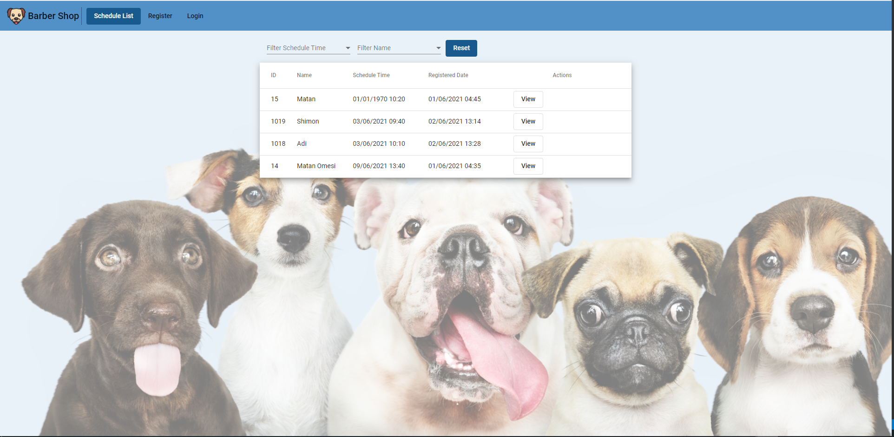

## Register Screen
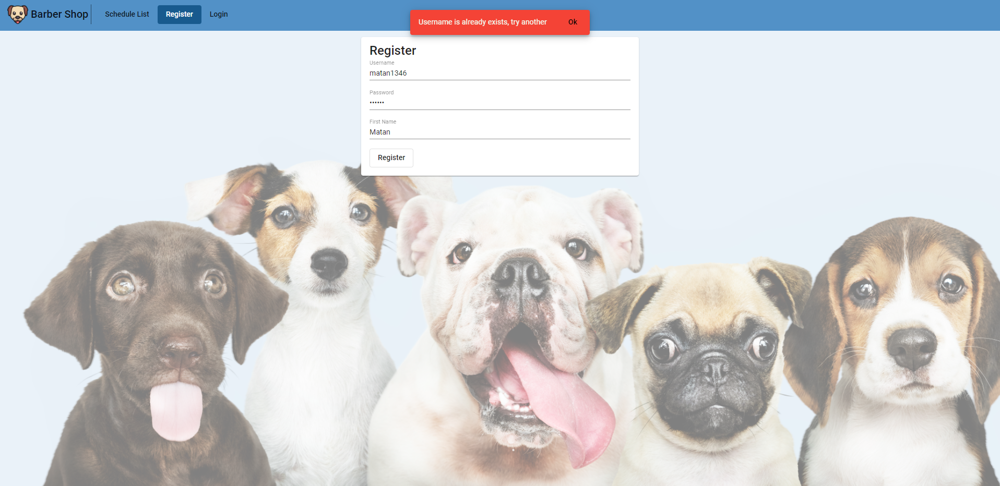
## Register Screeמ - Username is already exist
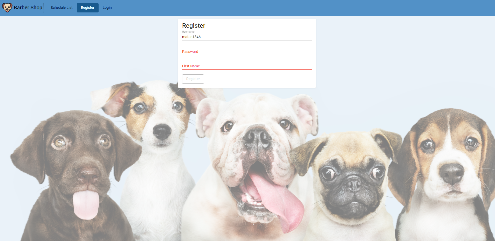

## Login Screen
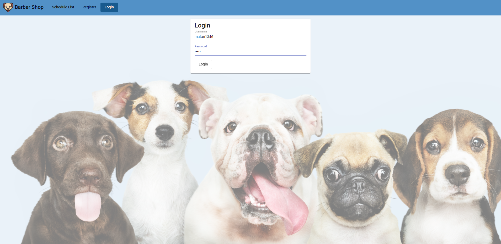
## Login Screen - Username or Password are incorrect
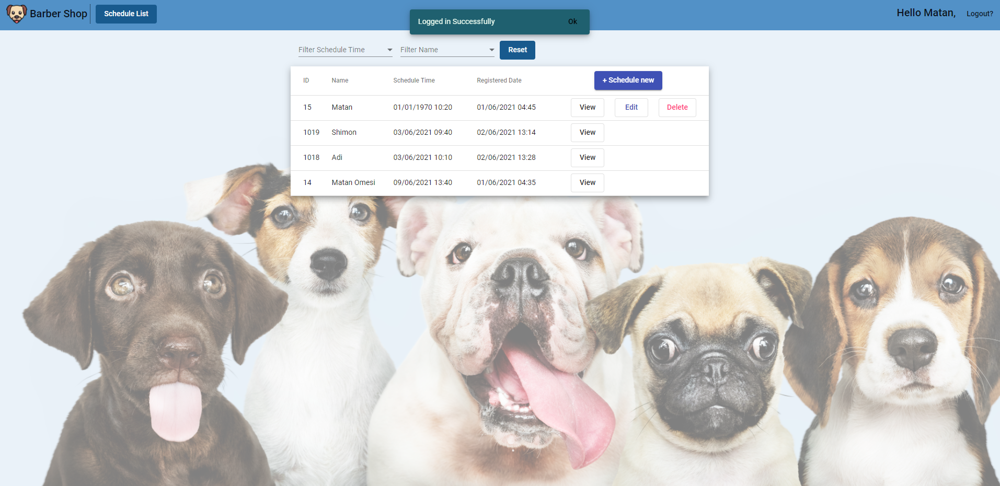
## Login Action - Logged Successfully

## Edit Schedule Screen- Time slot is already taken
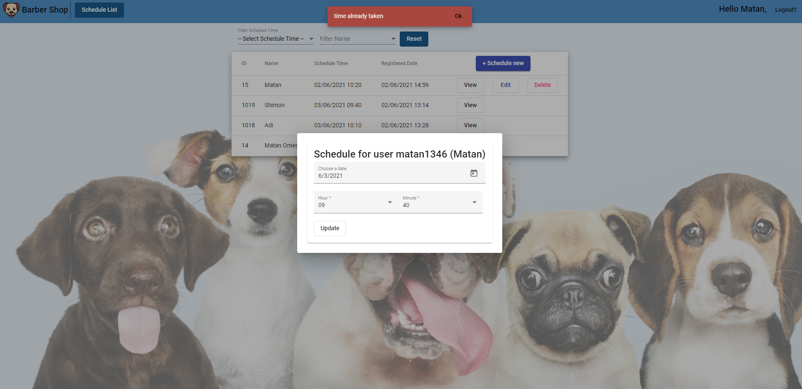
## Edit Schedule Action - Time has been updated
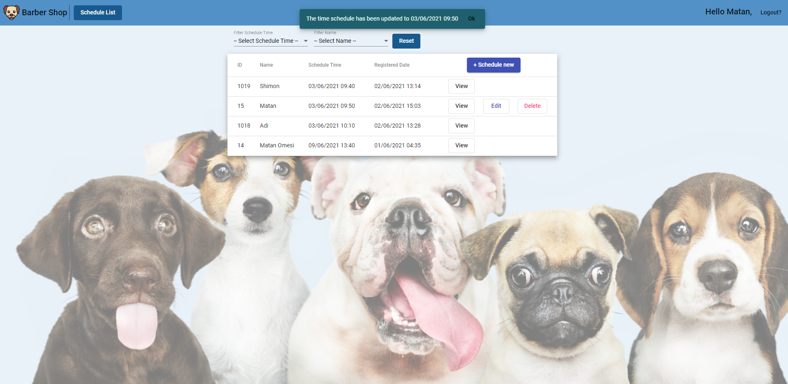

## View Schedult Screen
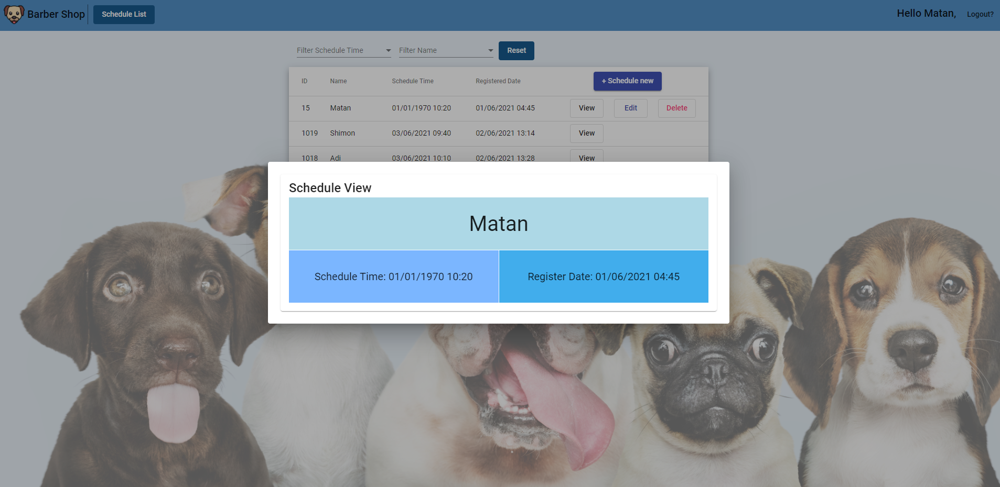

## Delete Schedule Action
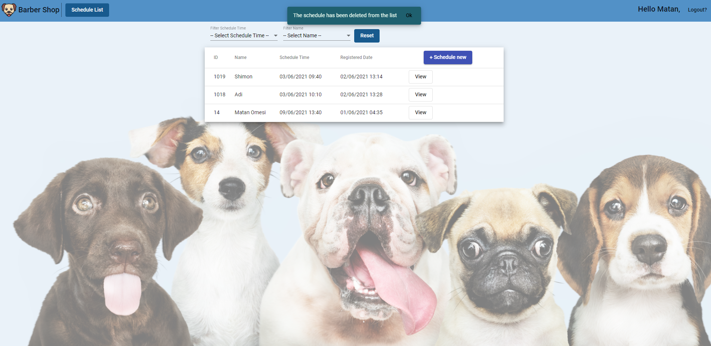

## Create Schedule Screen
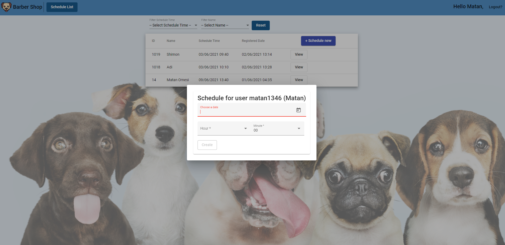
## Create Schedule Screen - Before submit
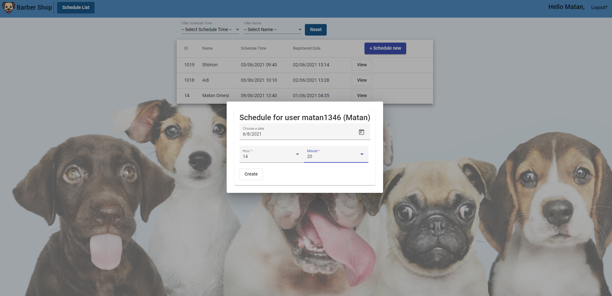
## Create Schedule Action - Schedult Slot created successfully

## Create Schedule Screen - Time slot is already taken

## Filter Screen - Date options
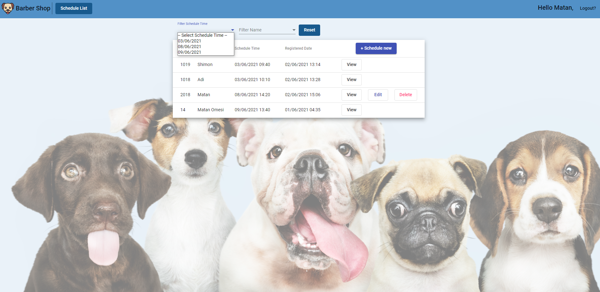
## Filter Screen - Filtered by specific date
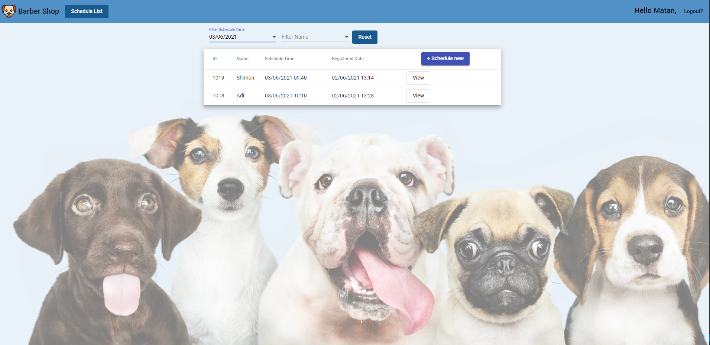
## Filter Screen - Name options

## Filter Screen - Filtered by specific name

## Filter Screen - filtered both by date and name -> showing the union records
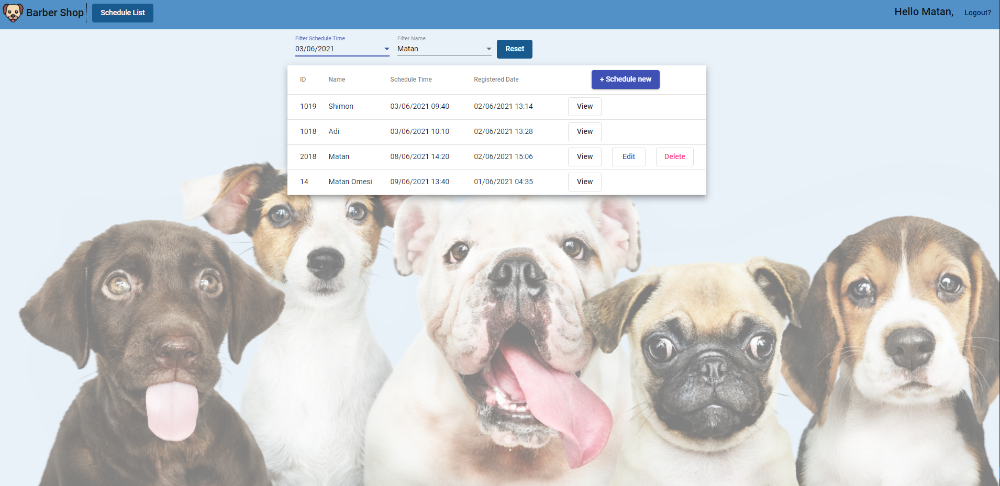

## Logout Action
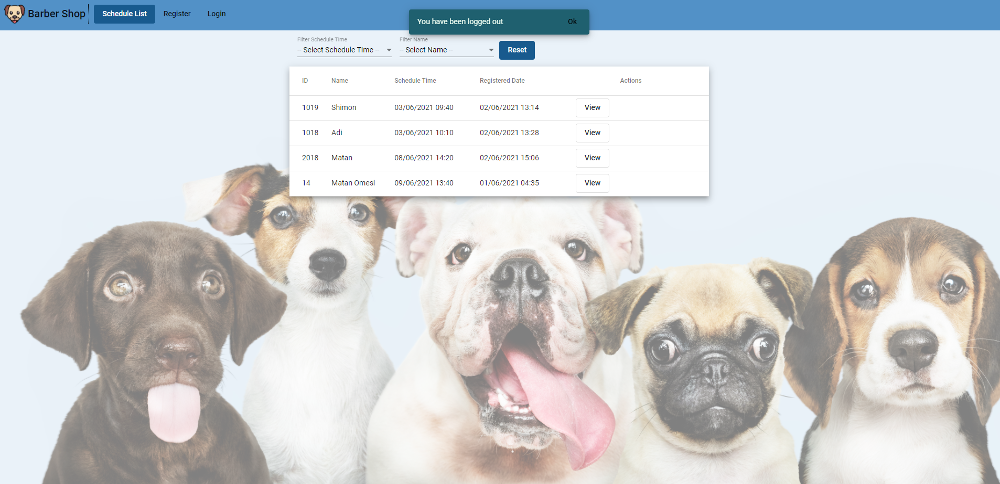

